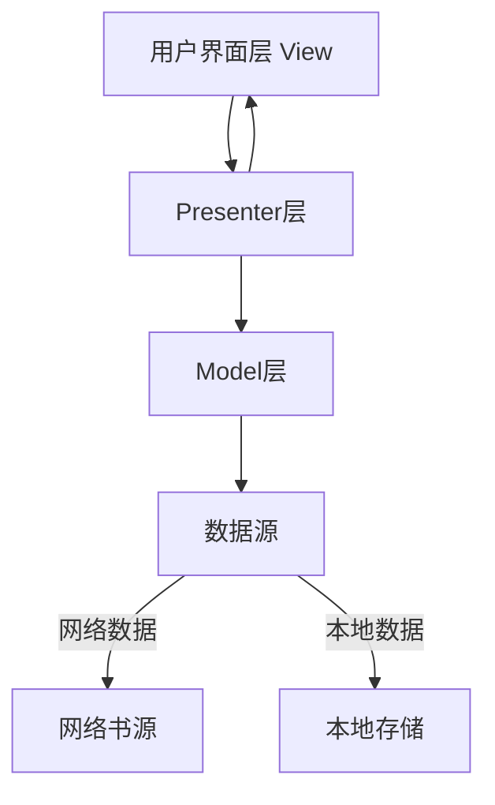
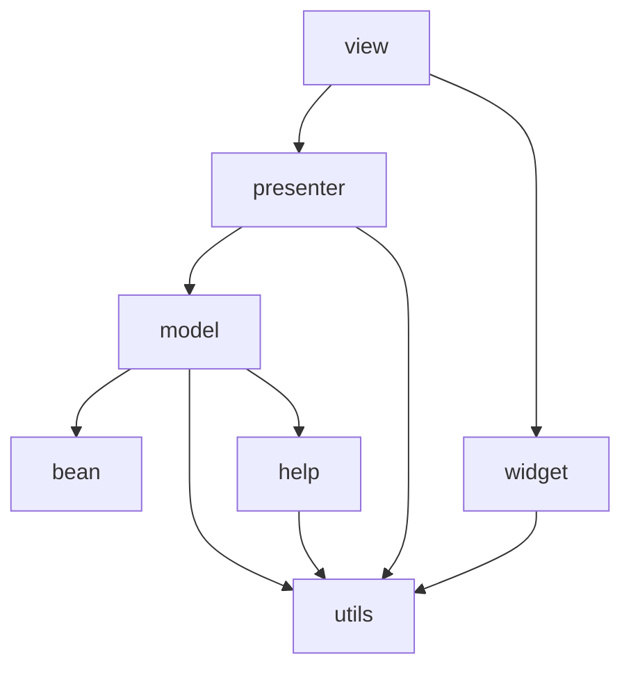

# 阅读应用 Code Wiki

## 1. 项目概述

**阅读**是一款开源的网络文学搜索和阅读工具，为用户提供方便、快捷、舒适的试读体验。

### 主要功能
- 网络文学搜索和聚合
- 多书源支持和管理
- 本地书籍导入和阅读
- 丰富的阅读设置（字体、背景、翻页模式等）
- 听书功能
- 书籍分类和管理
- 备份和恢复功能
- 主题切换（日间/夜间模式）
- Web服务功能

### 技术栈
- 开发语言：Java + Kotlin
- UI框架：Android SDK + Material Design
- 网络请求：OkHttp
- 响应式编程：RxJava
- 依赖注入：自定义实现
- 数据存储：SQLite (GreenDAO)
- 其他库：Timber (日志), Glide (图片加载)

## 2. 项目架构

### 2.1 整体架构

项目采用经典的MVP（Model-View-Presenter）架构模式，代码组织结构清晰，职责分明。



### 2.2 模块划分

| 模块 | 主要职责 | 路径 |
|------|---------|------|
| 基础模块 | 提供通用的基类和工具 | [base/](file:///workspace/app/src/main/java/com/kunfei/bookshelf/base/) |
| 数据模型 | 定义数据结构 | [bean/](file:///workspace/app/src/main/java/com/kunfei/bookshelf/bean/) |
| 常量定义 | 应用常量 | [constant/](file:///workspace/app/src/main/java/com/kunfei/bookshelf/constant/) |
| 工具帮助 | 提供各种工具方法 | [help/](file:///workspace/app/src/main/java/com/kunfei/bookshelf/help/) |
| 业务模型 | 实现核心业务逻辑 | [model/](file:///workspace/app/src/main/java/com/kunfei/bookshelf/model/) |
|  presenter | 连接View和Model | [presenter/](file:///workspace/app/src/main/java/com/kunfei/bookshelf/presenter/) |
| 服务组件 | 后台服务 | [service/](file:///workspace/app/src/main/java/com/kunfei/bookshelf/service/) |
| 工具类 | 通用工具方法 | [utils/](file:///workspace/app/src/main/java/com/kunfei/bookshelf/utils/) |
| 界面组件 | 活动和碎片 | [view/](file:///workspace/app/src/main/java/com/kunfei/bookshelf/view/) |
| Web服务 | 提供Web接口 | [web/](file:///workspace/app/src/main/java/com/kunfei/bookshelf/web/) |
| 自定义控件 | 自定义UI组件 | [widget/](file:///workspace/app/src/main/java/com/kunfei/bookshelf/widget/) |

## 3. 核心功能模块

### 3.1 书架管理

**功能描述**：管理用户添加的书籍，支持书籍分类、排序、搜索等操作。

**实现类**：
- [BookListFragment](file:///workspace/app/src/main/java/com/kunfei/bookshelf/view/fragment/BookListFragment.java) - 书架界面
- [BookShelfAdapter](file:///workspace/app/src/main/java/com/kunfei/bookshelf/view/adapter/BookShelfAdapter.java) - 书架适配器
- [MainPresenter](file:///workspace/app/src/main/java/com/kunfei/bookshelf/presenter/MainPresenter.java) - 书架相关逻辑

**核心功能**：
- 书籍添加/删除
- 书籍分组管理
- 书架布局切换（网格/列表）
- 书籍排序
- 批量操作

### 3.2 书籍搜索与发现

**功能描述**：通过多个书源搜索书籍，支持分类浏览和热门推荐。

**实现类**：
- [FindBookFragment](file:///workspace/app/src/main/java/com/kunfei/bookshelf/view/fragment/FindBookFragment.java) - 发现界面
- [SearchBookActivity](file:///workspace/app/src/main/java/com/kunfei/bookshelf/view/activity/SearchBookActivity.java) - 搜索界面
- [SearchBookPresenter](file:///workspace/app/src/main/java/com/kunfei/bookshelf/presenter/SearchBookPresenter.java) - 搜索逻辑

**核心功能**：
- 多书源搜索
- 分类浏览
- 热门推荐
- 搜索历史
- 书源管理

### 3.3 阅读功能

**功能描述**：提供舒适的阅读体验，支持多种阅读设置。

**实现类**：
- [ReadBookActivity](file:///workspace/app/src/main/java/com/kunfei/bookshelf/view/activity/ReadBookActivity.java) - 阅读界面
- [PageView](file:///workspace/app/src/main/java/com/kunfei/bookshelf/widget/page/PageView.java) - 阅读视图
- [PageLoader](file:///workspace/app/src/main/java/com/kunfei/bookshelf/widget/page/PageLoader.java) - 页面加载器
- [ReadBookPresenter](file:///workspace/app/src/main/java/com/kunfei/bookshelf/presenter/ReadBookPresenter.java) - 阅读逻辑

**核心功能**：
- 多种翻页模式（仿真、滑动、覆盖等）
- 字体大小、行间距、边距调整
- 背景主题切换
- 夜间模式
- 自动翻页
- 章节跳转
- 书签功能
- 文本选择和复制

### 3.4 听书功能

**功能描述**：将书籍内容转换为语音朗读。

**实现类**：
- [ReadAloudService](file:///workspace/app/src/main/java/com/kunfei/bookshelf/service/ReadAloudService.java) - 听书服务
- [ExoPlayerHelper](file:///workspace/app/src/main/java/com/kunfei/bookshelf/help/ExoPlayerHelper.kt) - 播放器辅助类

**核心功能**：
- 文本转语音
- 播放控制（暂停、继续、上一章、下一章）
- 语速调节
- 定时停止

### 3.5 书源管理

**功能描述**：管理书籍来源，支持添加、编辑、删除书源。

**实现类**：
- [BookSourceActivity](file:///workspace/app/src/main/java/com/kunfei/bookshelf/view/activity/BookSourceActivity.java) - 书源管理界面
- [BookSourcePresenter](file:///workspace/app/src/main/java/com/kunfei/bookshelf/presenter/BookSourcePresenter.java) - 书源管理逻辑
- [BookSourceManager](file:///workspace/app/src/main/java/com/kunfei/bookshelf/model/BookSourceManager.java) - 书源管理核心类

**核心功能**：
- 书源添加（手动、批量导入）
- 书源编辑
- 书源测试
- 书源排序和分组
- 书源启用/禁用

### 3.6 下载功能

**功能描述**：下载书籍章节以供离线阅读。

**实现类**：
- [DownloadActivity](file:///workspace/app/src/main/java/com/kunfei/bookshelf/view/activity/DownloadActivity.java) - 下载管理界面
- [DownloadService](file:///workspace/app/src/main/java/com/kunfei/bookshelf/service/DownloadService.java) - 下载服务
- [DownloadTaskImpl](file:///workspace/app/src/main/java/com/kunfei/bookshelf/model/task/DownloadTaskImpl.java) - 下载任务实现

**核心功能**：
- 章节批量下载
- 下载进度显示
- 下载队列管理
- 下载暂停/继续

### 3.7 备份与恢复

**功能描述**：备份应用数据和恢复。

**实现类**：
- [Backup](file:///workspace/app/src/main/java/com/kunfei/bookshelf/help/storage/Backup.kt) - 备份实现
- [Restore](file:///workspace/app/src/main/java/com/kunfei/bookshelf/help/storage/Restore.kt) - 恢复实现
- [WebDavHelp](file:///workspace/app/src/main/java/com/kunfei/bookshelf/help/storage/WebDavHelp.kt) - WebDAV备份支持

**核心功能**：
- 本地备份
- WebDAV备份
- 备份恢复

## 4. 关键类与函数

### 4.1 应用核心类

**MApplication**
- 位置：[MApplication.java](file:///workspace/app/src/main/java/com/kunfei/bookshelf/MApplication.java)
- 功能：应用全局类，负责初始化应用环境、主题设置、通知渠道创建等
- 关键方法：
  - `onCreate()`: 应用初始化
  - `initNightTheme()`: 初始化夜间主题
  - `upThemeStore()`: 更新主题设置
  - `setDownloadPath()`: 设置下载路径

**DbHelper**
- 位置：[DbHelper.java](file:///workspace/app/src/main/java/com/kunfei/bookshelf/DbHelper.java)
- 功能：数据库帮助类，管理应用数据库
- 关键方法：
  - `getDaoSession()`: 获取DAO会话
  - `initDb()`: 初始化数据库

### 4.2 书架相关

**BookShelfBean**
- 位置：[BookShelfBean.java](file:///workspace/app/src/main/java/com/kunfei/bookshelf/bean/BookShelfBean.java)
- 功能：书架书籍数据模型
- 关键属性：
  - `bookInfoBean`: 书籍信息
  - `durChapter`: 当前章节
  - `durChapterPage`: 当前章节页码
  - `finalDate`: 最后阅读时间

**MainActivity**
- 位置：[MainActivity.java](file:///workspace/app/src/main/java/com/kunfei/bookshelf/view/activity/MainActivity.java)
- 功能：应用主界面，包含书架和发现两个标签页
- 关键方法：
  - `createTabFragments()`: 创建标签页碎片
  - `upGroup()`: 更新书架分组
  - `selectBookshelfLayout()`: 选择书架布局

### 4.3 阅读相关

**ReadBookActivity**
- 位置：[ReadBookActivity.java](file:///workspace/app/src/main/java/com/kunfei/bookshelf/view/activity/ReadBookActivity.java)
- 功能：阅读界面，提供阅读和相关设置
- 关键方法：
  - `initPageView()`: 初始化阅读视图
  - `popMenuIn()`: 显示阅读菜单
  - `popMenuOut()`: 隐藏阅读菜单
  - `autoPage()`: 自动翻页
  - `readAloud()`: 开始朗读

**PageLoader**
- 位置：[PageLoader.java](file:///workspace/app/src/main/java/com/kunfei/bookshelf/widget/page/PageLoader.java)
- 功能：页面加载器，负责加载和显示书籍内容
- 关键方法：
  - `refreshChapterList()`: 刷新章节列表
  - `skipToNextPage()`: 跳转到下一页
  - `skipToPrePage()`: 跳转到上一页
  - `setTextSize()`: 设置字体大小
  - `upMargin()`: 更新边距

**ReadBookControl**
- 位置：[ReadBookControl.java](file:///workspace/app/src/main/java/com/kunfei/bookshelf/help/ReadBookControl.java)
- 功能：阅读控制类，管理阅读设置
- 关键方法：
  - `getTextSize()`: 获取字体大小
  - `getPageMode()`: 获取翻页模式
  - `getBgColor()`: 获取背景颜色
  - `getScreenDirection()`: 获取屏幕方向

### 4.4 书源相关

**BookSourceBean**
- 位置：[BookSourceBean.java](file:///workspace/app/src/main/java/com/kunfei/bookshelf/bean/BookSourceBean.java)
- 功能：书源数据模型
- 关键属性：
  - `bookSourceName`: 书源名称
  - `bookSourceUrl`: 书源地址
  - `searchUrl`: 搜索地址
  - `bookInfoUrl`: 书籍信息地址
  - `chapterUrl`: 章节列表地址

**BookSourceManager**
- 位置：[BookSourceManager.java](file:///workspace/app/src/main/java/com/kunfei/bookshelf/model/BookSourceManager.java)
- 功能：书源管理类，负责书源的加载、保存和管理
- 关键方法：
  - `getBookSourceBeanList()`: 获取书源列表
  - `addBookSource()`: 添加书源
  - `deleteBookSource()`: 删除书源
  - `updateBookSource()`: 更新书源

### 4.5 网络相关

**WebBook**
- 位置：[WebBook.java](file:///workspace/app/src/main/java/com/kunfei/bookshelf/model/content/WebBook.java)
- 功能：网络书籍内容获取类
- 关键方法：
  - `getBookInfo()`: 获取书籍信息
  - `getChapterList()`: 获取章节列表
  - `getBookContent()`: 获取章节内容

**AnalyzeRule**
- 位置：[AnalyzeRule.java](file:///workspace/app/src/main/java/com/kunfei/bookshelf/model/analyzeRule/AnalyzeRule.java)
- 功能：解析规则类，用于解析网页内容
- 关键方法：
  - `setContent()`: 设置要解析的内容
  - `getString()`: 获取解析后的字符串
  - `getStrings()`: 获取解析后的字符串列表

## 5. 数据模型

### 5.1 核心数据模型

| 类名 | 描述 | 路径 |
|------|------|------|
| BookShelfBean | 书架书籍模型 | [BookShelfBean.java](file:///workspace/app/src/main/java/com/kunfei/bookshelf/bean/BookShelfBean.java) |
| BookInfoBean | 书籍信息模型 | [BookInfoBean.java](file:///workspace/app/src/main/java/com/kunfei/bookshelf/bean/BookInfoBean.java) |
| BookChapterBean | 章节模型 | [BookChapterBean.java](file:///workspace/app/src/main/java/com/kunfei/bookshelf/bean/BookChapterBean.java) |
| BookContentBean | 章节内容模型 | [BookContentBean.java](file:///workspace/app/src/main/java/com/kunfei/bookshelf/bean/BookContentBean.java) |
| BookSourceBean | 书源模型 | [BookSourceBean.java](file:///workspace/app/src/main/java/com/kunfei/bookshelf/bean/BookSourceBean.java) |
| ReplaceRuleBean | 替换规则模型 | [ReplaceRuleBean.java](file:///workspace/app/src/main/java/com/kunfei/bookshelf/bean/ReplaceRuleBean.java) |
| BookmarkBean | 书签模型 | [BookmarkBean.java](file:///workspace/app/src/main/java/com/kunfei/bookshelf/bean/BookmarkBean.java) |

### 5.2 数据库结构

应用使用GreenDAO ORM框架操作SQLite数据库，主要表结构如下：

| 表名 | 对应实体类 | 主要字段 |
|------|-----------|----------|
| BOOK_SHELF | BookShelfBean | id, noteUrl, bookInfo, durChapter, durChapterPage, finalDate |
| BOOK_INFO | BookInfoBean | id, name, author, coverUrl, intro, chapterUrl, bookSourceUrl |
| BOOK_CHAPTER | BookChapterBean | id, bookId, durChapterName, durChapterUrl, chapterIndex, isVip, isPay |
| BOOK_CONTENT | BookContentBean | id, bookId, chapterIndex, content |
| BOOK_SOURCE | BookSourceBean | id, bookSourceName, bookSourceUrl, searchUrl, bookInfoUrl, chapterUrl |
| REPLACE_RULE | ReplaceRuleBean | id, replaceSummary, regex, replacement, isRegex, enable, serialNumber, useTo |
| BOOKMARK | BookmarkBean | id, noteUrl, bookName, chapterName, content, pageIndex, addTime |

## 6. 依赖关系

### 6.1 主要依赖库

| 依赖 | 版本 | 用途 | 来源 |
|------|------|------|------|
| AndroidX | - | Android支持库 | build.gradle |
| OkHttp | - | 网络请求 | build.gradle |
| RxJava | - | 响应式编程 | build.gradle |
| GreenDAO | - | ORM数据库 | build.gradle |
| Timber | - | 日志工具 | build.gradle |
| Glide | - | 图片加载 | build.gradle |
| RxBind | - | 事件总线 | build.gradle |
| ExoPlayer | - | 媒体播放器 | build.gradle |

### 6.2 模块依赖关系



## 7. 项目运行与构建

### 7.1 环境要求

- Android Studio
- JDK 8+
- Android SDK 21+

### 7.2 构建步骤

1. 克隆项目到本地
2. 在Android Studio中打开项目
3. 等待Gradle同步完成
4. 构建项目：`./gradlew build`
5. 运行应用到设备或模拟器

### 7.3 配置文件

- `gradle.properties`: Gradle配置
- `key.properties.jks`: 签名配置
- `MyBookshelf_Keys.zip`: 包含密钥文件（需解压到app目录）

### 7.4 运行选项

- **Debug模式**：用于开发和调试
- **Release模式**：用于发布

## 8. 关键功能使用指南

### 8.1 添加书籍

1. **搜索添加**：在搜索页面输入书名，选择书源搜索，然后添加到书架
2. **URL添加**：在菜单中选择"添加网址"，输入书籍URL
3. **扫码添加**：使用扫码功能扫描书籍二维码
4. **本地导入**：在菜单中选择"导入本地书籍"，选择本地文件

### 8.2 阅读设置

1. **字体设置**：点击阅读界面中心，在弹出的菜单中选择"阅读设置"，调整字体大小、行间距
2. **背景设置**：在阅读设置中选择背景主题
3. **翻页模式**：在阅读设置中选择翻页模式（仿真、滑动、覆盖等）
4. **夜间模式**：点击阅读界面中心，在底部菜单中点击夜间模式按钮

### 8.3 书源管理

1. **添加书源**：在侧边栏选择"书源管理"，点击添加按钮，输入书源信息
2. **编辑书源**：长按书源，选择编辑，修改书源信息
3. **测试书源**：在书源编辑页面点击测试按钮，测试书源是否可用
4. **导入书源**：在书源管理页面，点击菜单，选择导入书源，支持批量导入

### 8.4 听书功能

1. **开始听书**：点击阅读界面中心，在底部菜单中点击听书按钮
2. **调整语速**：在听书控制界面，调整语速滑块
3. **定时停止**：在听书控制界面，设置定时停止时间

### 8.5 备份与恢复

1. **本地备份**：在侧边栏选择"备份"，选择备份位置，点击备份
2. **WebDAV备份**：在设置中配置WebDAV信息，然后选择WebDAV备份
3. **恢复**：在侧边栏选择"恢复"，选择备份文件，点击恢复

## 9. 常见问题与解决方案

### 9.1 书源无法使用

**问题**：某些书源搜索或章节加载失败

**解决方案**：
- 检查网络连接
- 测试书源是否可用
- 更新书源规则
- 添加新的书源

### 9.2 阅读卡顿

**问题**：阅读时页面切换卡顿

**解决方案**：
- 清理应用缓存
- 减少同时运行的应用
- 调整阅读设置，减少动画效果
- 对于E-Ink设备，启用E-Ink模式

### 9.3 听书功能异常

**问题**：听书功能无法正常工作

**解决方案**：
- 检查系统TTS设置
- 确保网络连接（在线TTS）
- 尝试更换TTS引擎

### 9.4 备份失败

**问题**：备份过程中失败

**解决方案**：
- 检查存储空间是否充足
- 检查备份路径权限
- 对于WebDAV备份，检查网络连接和WebDAV服务器状态

## 10. 总结与亮点回顾

### 10.1 项目亮点

1. **多书源聚合**：支持多个网络文学网站，为用户提供丰富的内容选择
2. **高度自定义**：提供丰富的阅读设置，满足不同用户的阅读偏好
3. **离线阅读**：支持章节下载，实现完全离线阅读
4. **听书功能**：内置文本转语音功能，支持多种播放控制
5. **书源管理**：用户可以自由添加、编辑和管理书源
6. **主题切换**：支持日间/夜间模式，保护眼睛
7. **备份恢复**：支持本地和WebDAV备份，确保数据安全
8. **Web服务**：提供Web接口，支持远程管理

### 10.2 技术亮点

1. **模块化设计**：清晰的代码结构，便于维护和扩展
2. **响应式编程**：使用RxJava实现异步操作，提高代码可读性
3. **自定义阅读引擎**：实现了多种翻页模式和阅读效果
4. **灵活的解析规则**：支持多种网页解析方式，适应不同网站结构
5. **性能优化**：针对阅读场景进行了专门的性能优化

### 10.3 未来发展建议

1. **增加更多书源**：持续更新和添加新的书源
2. **优化阅读体验**：进一步改进阅读界面和交互
3. **增强听书功能**：支持更多TTS引擎和语音效果
4. **添加社区功能**：允许用户分享书源和阅读心得
5. **跨平台支持**：考虑开发iOS或Web版本

## 11. 附录

### 11.1 目录结构

```
app/
├── src/
│   ├── main/
│   │   ├── java/com/kunfei/bookshelf/
│   │   │   ├── base/          # 基础类
│   │   │   ├── bean/          # 数据模型
│   │   │   ├── constant/      # 常量定义
│   │   │   ├── help/          # 工具帮助类
│   │   │   ├── model/         # 业务模型
│   │   │   ├── presenter/     # Presenter层
│   │   │   ├── service/       # 后台服务
│   │   │   ├── utils/         # 工具类
│   │   │   ├── view/          # 界面组件
│   │   │   ├── web/           # Web服务
│   │   │   ├── widget/        # 自定义控件
│   │   │   ├── DbHelper.java  # 数据库帮助类
│   │   │   └── MApplication.java # 应用全局类
│   │   ├── res/               # 资源文件
│   │   ├── assets/            # 资产文件
│   │   └── AndroidManifest.xml # 应用清单
│   └── debug/                 # 调试资源
├── build.gradle               # 构建配置
└── proguard-rules.pro         # 混淆规则
```

### 11.2 重要配置项

| 配置项 | 描述 | 默认值 | 位置 |
|--------|------|--------|------|
| nightTheme | 夜间模式 | false | SharedPreferences |
| downloadPath | 下载路径 | 应用内部存储 | SharedPreferences |
| bookshelfLayout | 书架布局 | 0 (网格) | SharedPreferences |
| fontSize | 字体大小 | 16 | SharedPreferences |
| pageMode | 翻页模式 | 0 (仿真) | SharedPreferences |
| bgColor | 背景颜色 | 0 (默认) | SharedPreferences |

### 11.3 快捷键与手势

| 手势/快捷键 | 功能 | 适用界面 |
|------------|------|----------|
| 点击屏幕中心 | 显示/隐藏阅读菜单 | 阅读界面 |
| 左右滑动 | 翻页 | 阅读界面 |
| 双击屏幕 | 显示/隐藏阅读菜单 | 阅读界面 |
| 长按文本 | 选择文本 | 阅读界面 |
| 菜单键 | 显示操作菜单 | 主界面 |
| 返回键 | 退出当前界面 | 所有界面 |

### 11.4 版本历史

| 版本 | 主要更新 |
|------|----------|
| 1.0.0 | 初始版本 |
| 1.1.0 | 添加听书功能 |
| 1.2.0 | 优化阅读体验 |
| 1.3.0 | 添加WebDAV备份 |
| 1.4.0 | 增强书源管理 |
| 1.5.0 | 优化性能和稳定性 |

---

**注**：本项目已迁移到新地址并使用Kotlin重新开发，新地址为：https://github.com/gedoor/legado

本软件为开源软件，请勿在任何地方购买！